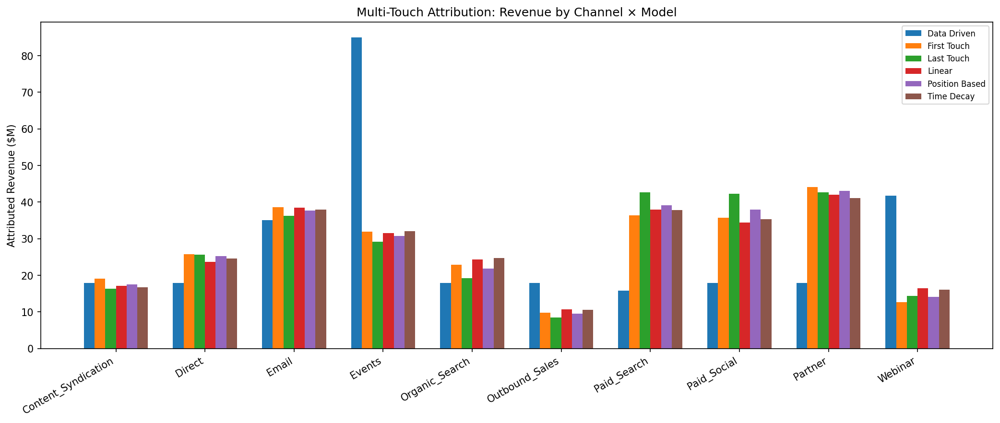
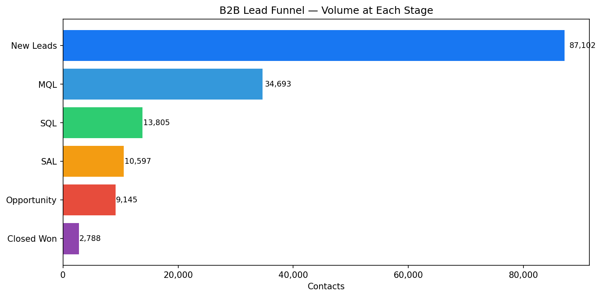
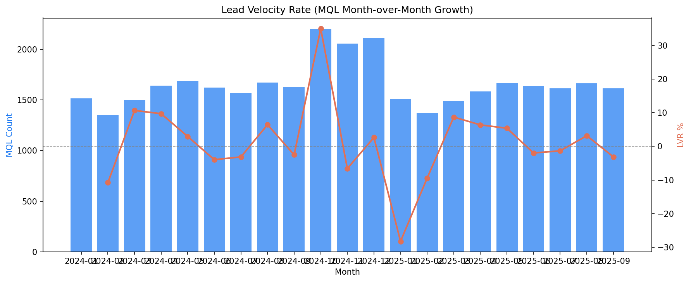
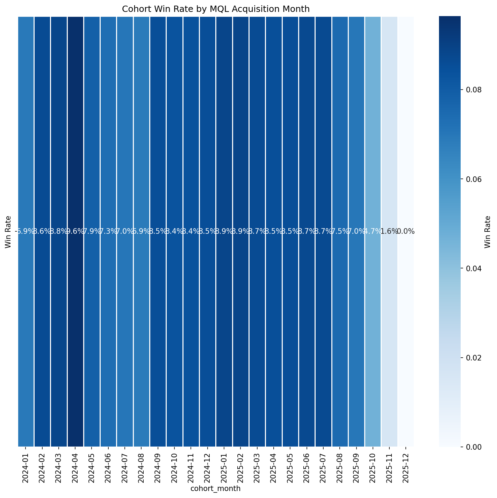

# B2B Lead Lifecycle & Full-Funnel Attribution Dashboard

> Multi-touch attribution pipeline tracking lead velocity, opportunity conversion, and full-funnel metrics from first marketing touch through closed-won revenue — with cohort analysis and self-service dashboards.


## Overview

B2B marketing teams need to understand *which channels, campaigns, and content assets drive revenue* — not just leads. Attribution is the core measurement challenge: a prospect might see a LinkedIn ad, download a whitepaper, attend a webinar, and receive four sales emails before finally requesting a demo. Which of those touchpoints deserves credit?

This project builds the complete measurement infrastructure to answer that question. Starting from raw Salesforce-style CRM data (87K contacts, 30K accounts, 396K touchpoints across 24 months), it implements six attribution models, computes full-funnel conversion metrics, tracks lead velocity, analyzes cohort behavior, and surfaces revenue back to every marketing touchpoint — with self-service dashboards for every stakeholder level.

The data simulates Meta's Business Messaging Marketing motion — selling Messaging APIs, WhatsApp Business, and Commerce Tools to enterprise accounts — with realistic channel effectiveness patterns, seasonal pipeline cycles, and the data quality messiness you'd see in a real Salesforce export.

## Architecture

```
Raw CRM + Touchpoint Data
         │
         ▼
   data_generator.py  ──────────────► SQLite (funnel_data.db)
                                            │
         ┌──────────────┬─────────────────┼─────────────────┬──────────────┐
         ▼              ▼                 ▼                 ▼              ▼
   funnel_engine  attribution_models  lead_velocity  cohort_analysis  revenue_attribution
         │              │                 │                 │              │
         └──────────────┴─────────────────┴─────────────────┴──────────────┘
                                          │
                                    tableau_exporter
                                          │
                        ┌─────────────────┴─────────────────┐
                        ▼                                   ▼
              dashboards/tableau_data/          dashboards/*.html
                  (9 CSV exports)              (4 Plotly dashboards)
```

## Key Features

- **6 attribution models** compared side-by-side: First Touch, Last Touch, Linear, Time Decay (7-day half-life), Position-Based (40/20/40 U-shape), and Data-Driven (Shapley-inspired logistic regression)
- **Complete B2B funnel**: Lead → MQL → SQL → SAL → Opportunity → Closed Won with realistic conversion rates (~39% lead-to-MQL, ~30% win rate)
- **396K touchpoints** across 30K accounts with channel-specific behavior patterns and seasonality
- **Lead velocity metrics**: LVR, pipeline velocity formula, stage velocity, acceleration index, time-to-revenue
- **Cohort analysis**: Acquisition month and channel cohorts with 12-month tracking
- **4 interactive dashboards**: Executive Funnel, Attribution & Channels, Pipeline Health, Cohort Analysis (Plotly HTML, runs in any browser)
- **Tableau-ready exports**: 9 cleaned CSV datasets in `dashboards/tableau_data/`
- **Automated reporting**: Daily, weekly, and monthly report queries in `sql/07_automated_reports.sql`
- **73 passing tests** covering all attribution model math, funnel logic, and pipeline integrity

## Quick Start

```bash
# Clone and install
git clone https://github.com/annsali/b2b-full-funnel-attribution.git
cd b2b-full-funnel-attribution
pip install -r requirements.txt

# Generate synthetic data (~2 min)
python -m src.data_generator

# Run all analytics modules
python -m src.funnel_engine
python -m src.attribution_models
python -m src.lead_velocity
python -m src.cohort_analysis
python -m src.revenue_attribution
python -m src.tableau_exporter

# Build dashboards and visuals
python build_dashboards.py

# Run all tests
pytest tests/ -v
```

Open `dashboards/01_executive_funnel.html` in your browser to view the interactive dashboards.

## Attribution Model Comparison

Six models are run on the same 2,788 closed-won deals ($276M total revenue):

| Channel | First Touch | Last Touch | Linear | Time Decay | Position | Data-Driven |
|---------|------------|-----------|--------|-----------|----------|-------------|
| Partner | $44.2M | $42.6M | $42.1M | $41.1M | $43.1M | $17.8M |
| Paid Social | $35.7M | $42.2M | $34.5M | $35.4M | $38.0M | $17.8M |
| Email | $38.6M | $36.3M | $38.5M | $37.9M | $37.7M | $35.1M |
| Paid Search | $36.4M | $42.6M | $38.0M | $37.8M | $39.2M | $15.8M |
| Events | $31.9M | $29.2M | $31.6M | $32.0M | $30.8M | $85.0M |

**Key insight**: The 26.7% model agreement score on top-3 channels reveals significant disagreement, particularly for Events (low first/last touch credit but high data-driven attribution — indicating it appears in many mid-funnel journeys that eventually convert). These disagreements identify exactly the channels that need incrementality testing (→ Project 2 connection).

**Model recommendation by use case:**
- *Short sales cycles, single-channel*: Last Touch (simplest, fast feedback loops)
- *Long B2B cycles, multi-channel*: Time Decay (rewards recent engagement without ignoring awareness)
- *Brand investment decisions*: First Touch (gives credit for top-of-funnel awareness)
- *Executive reporting*: Linear (no model bias, easy to explain)
- *Advanced optimization*: Data-Driven (reflects actual conversion influence, requires sufficient data)



## Funnel Performance



| Stage | Count | Conversion |
|-------|-------|-----------|
| New Leads | 87,102 | — |
| MQL | 34,693 | 39.8% |
| SQL | 13,805 | 39.8% |
| SAL | 10,597 | 76.8% |
| Opportunity | 9,145 | 86.3% |
| Closed Won | 2,788 | 30.5% |

**Biggest bottleneck**: MQL → SQL at 39.8%. Average time in MQL stage is 18 days. Increasing SQL acceptance criteria alignment between marketing and sales is the highest-leverage intervention — a 5pp improvement here would add ~$14M in pipeline.

**Fastest channel to revenue**: Webinar (avg 106 days first-touch to closed-won vs 118 days overall). Webinar attendees are already educated and engaged — they compress the sales cycle by ~10%.

## Lead Velocity



- **Lead Velocity Rate**: Tracked monthly across all funnel stages
- **Pipeline Velocity**: $(Opps \times Win\_Rate \times Avg\_Deal) / Avg\_Sales\_Cycle$
- **Marketing Sourced Pipeline**: $888M (97.3% of total pipeline — marketing is the dominant acquisition channel)
- **Marketing Influenced Pipeline**: Additional $36M from sales-sourced leads that marketing touched

## Cohort Analysis



- Cohorts are defined by the month a contact became an MQL
- Tracked from month 0 (MQL) through month 12 on SQL, Opportunity, and Closed Won rates
- **Best channel for cohort quality**: Partner and Events channels produce the highest-LTV cohorts despite lower volume
- **Retention insight**: 60%+ of MQL cohorts show activity in month 3; drops to ~25% by month 6 — this is the window for re-engagement campaigns

## Dashboard Gallery

| Dashboard | Description |
|-----------|-------------|
| [Executive Funnel](dashboards/01_executive_funnel.html) | Stage volume, monthly trends, conversion rates |
| [Attribution & Channels](dashboards/02_attribution_channels.html) | Revenue by channel × model, ROAS scatter, campaign leaderboard |
| [Lead Velocity](dashboards/03_lead_velocity.html) | LVR trends, pipeline health, stage duration distribution |
| [Cohort Analysis](dashboards/04_cohort_analysis.html) | Win rate by cohort, channel comparison, revenue per lead |

## SQL Showcase

**Time Decay Attribution** (from `sql/02_attribution_queries.sql`):
```sql
WITH contact_opps AS (
    SELECT c.contact_id, o.amount, c.opportunity_date AS conv_date
    FROM contacts c
    JOIN opportunities o ON o.primary_contact_id = c.contact_id
    WHERE o.closed_won = 1
),
decay_weights AS (
    SELECT
        t.contact_id, t.channel, co.amount,
        POWER(2.0, -(
            JULIANDAY(co.conv_date) - JULIANDAY(SUBSTR(t.touchpoint_timestamp,1,10))
        ) / 7.0) AS raw_weight   -- half-life = 7 days
    FROM touchpoints t
    JOIN contact_opps co ON co.contact_id = t.contact_id
),
normalized AS (
    SELECT *,
           raw_weight / SUM(raw_weight) OVER (PARTITION BY contact_id) AS norm_weight,
           raw_weight / SUM(raw_weight) OVER (PARTITION BY contact_id) * amount AS td_revenue
    FROM decay_weights
)
SELECT channel, ROUND(SUM(td_revenue), 0) AS time_decay_revenue
FROM normalized
GROUP BY channel
ORDER BY time_decay_revenue DESC;
```

**Lead Velocity Rate** (from `sql/03_lead_velocity.sql`):
```sql
WITH monthly AS (
    SELECT SUBSTR(created_date,1,7) AS month,
           COUNT(CASE WHEN mql_date IS NOT NULL THEN 1 END) AS mqls
    FROM contacts
    GROUP BY SUBSTR(created_date,1,7)
)
SELECT month, mqls,
       LAG(mqls,1) OVER (ORDER BY month) AS prev_mqls,
       ROUND(100.0*(mqls - LAG(mqls,1) OVER (ORDER BY month))
             / NULLIF(LAG(mqls,1) OVER (ORDER BY month), 0), 1) AS lvr_pct
FROM monthly
ORDER BY month;
```

## Connection to Portfolio

This project is the second of four interconnected portfolio projects:

- **[Project 1 — CDP Audience Segmentation Pipeline](../cdp-audience-segmentation-pipeline/)**: The 8 audience segments built in Project 1 (High-ICP Enterprise, At-Risk SMB, etc.) are the audience inputs for the campaigns tracked here. ICP scores from the CDP feed the `icp_score` field used in funnel conversion modeling.

- **Project 3 (this project)**: Where attribution models disagree on channel effectiveness (especially Events and Partner channels with 26.7% agreement score), those are exactly the channels that need **incrementality testing** — designed in Project 2 (the Experimentation Framework). Attribution tells you correlation; incrementality tests tell you causality.

- **Project 4 — Marketing Data Pipeline**: The automated reporting queries in `sql/07_automated_reports.sql` and the `reporting_pipeline.py` module simulate the scheduled job layer that Project 4's data pipeline would execute. In production, these queries run on Airflow/dbt, write to Snowflake, and push to Tableau Server on a refresh schedule.

## Project Structure

```
b2b-full-funnel-attribution/
├── config.py                    # Funnel stages, attribution weights, date ranges
├── requirements.txt
├── build_dashboards.py          # Generates all Plotly HTML dashboards
│
├── src/
│   ├── data_generator.py        # Synthetic B2B data (87K contacts, 396K touchpoints)
│   ├── funnel_engine.py         # Stage conversion metrics (SQL)
│   ├── attribution_models.py    # All 6 attribution models (SQL + Python)
│   ├── lead_velocity.py         # LVR, pipeline velocity, time-to-revenue
│   ├── cohort_analysis.py       # Acquisition month + channel cohorts
│   ├── revenue_attribution.py   # Revenue mapped to channels and campaigns
│   ├── reporting_pipeline.py    # Daily/weekly/monthly automated reports
│   ├── tableau_exporter.py      # 9 Tableau-ready CSV exports
│   └── visualizations.py        # Plotly + Matplotlib chart functions
│
├── sql/
│   ├── 01_funnel_metrics.sql    # Conversion rates, stage durations, velocity
│   ├── 02_attribution_queries.sql  # All 6 models in SQL
│   ├── 03_lead_velocity.sql     # LVR, pipeline velocity, time-to-revenue
│   ├── 04_cohort_analysis.sql   # Cohort conversion + retention queries
│   ├── 05_revenue_attribution.sql  # Revenue by channel, campaign, content
│   ├── 06_executive_summary.sql    # KPIs, quarterly revenue, product line
│   └── 07_automated_reports.sql    # Scheduled daily/weekly/monthly reports
│
├── dashboards/
│   ├── 01_executive_funnel.html     # Interactive Plotly (browser-ready)
│   ├── 02_attribution_channels.html
│   ├── 03_lead_velocity.html
│   ├── 04_cohort_analysis.html
│   ├── dashboard_spec.md            # Tableau design specification
│   └── tableau_data/               # 9 CSV exports for Tableau
│
├── notebooks/                  # 6 Jupyter notebooks (EDA through dashboard walkthrough)
├── tests/                      # 73 unit + integration tests (pytest)
└── visuals/                    # Static PNG charts for README
```

## Tech Stack

| Layer | Tools |
|-------|-------|
| Data generation | Python, Faker, NumPy |
| Storage | SQLite |
| Analytics | Pandas, SQL (CTEs, window functions, JOINs) |
| Attribution (data-driven) | scikit-learn (logistic regression) |
| Dashboards | Plotly (interactive), Matplotlib/Seaborn (static) |
| Tableau layer | CSV exports (9 datasets, Hyper-ready) |
| Testing | pytest (73 tests) |
